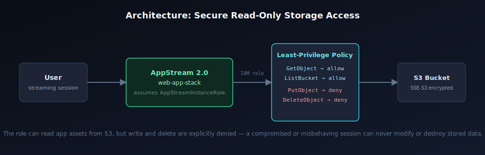

# AppStream 2.0 + S3: Secure Read-Only Application Streaming

**One-sentence summary:** A least-privilege AWS setup that lets AppStream 2.0 stream an app to users while guaranteeing the app's IAM role can read its assets from S3 but can never write, modify, or delete them.

**Tools used:** AWS AppStream 2.0 · Amazon S3 · IAM (least-privilege policies) · AWS CLI

**Why it's secure:** The instance role attached to the AppStream fleet is scoped to exactly two actions — `s3:GetObject` and `s3:ListBucket` — and everything else, including writes and deletes, is explicitly denied rather than just left out. That's the difference between "the role happens to not have write access" and "the role is guaranteed to never get write access, even if the policy is edited carelessly later."

## Live data flow

```
   LOCAL MACHINE                  AWS APPSTREAM 2.0                  S3 BUCKET
  ┌──────────────┐      ①      ┌────────────────────────┐      ②      ┌────────────────────────┐
  │  dev assets  │  ─────────► │  web-app-stack          │  ─────────► │  my-appstream-storage   │
  │ (local disk) │             │  assumes AppStreamRole  │             │  SSE-S3 encrypted       │
  └──────────────┘             └────────────────────────┘             └────────────────────────┘

  ①  aws s3 cp ./app s3://my-appstream-storage/app/ --recursive
      (one-time / on-deploy upload from the local machine)

  ②  Live streaming session reads through the IAM role — enforced per request:

        s3:GetObject     → ALLOWED
        s3:ListBucket    → ALLOWED
        s3:PutObject     → DENIED   (blocked at the IAM layer, never reaches the bucket)
        s3:DeleteObject  → DENIED   (blocked at the IAM layer, never reaches the bucket)
```

A rendered version of this same flow: [`docs/architecture.png`](docs/architecture.png)



---

## Folder structure

```
.
├── README.md
├── LICENSE
├── scripts/
│   ├── upload-app-assets.sh        # pushes app assets to the S3 bucket
│   └── validate-iam-policy.sh      # proves the deny rules actually work
├── policies/
│   ├── appstream-s3-readonly-policy.json   # the least-privilege permission policy
│   └── appstream-trust-policy.json         # who's allowed to assume the role
└── docs/
    ├── architecture.svg
    └── architecture.png
```

## Security guardrails (the IAM policy)

[`policies/appstream-s3-readonly-policy.json`](policies/appstream-s3-readonly-policy.json) does two things, deliberately:

1. **Allows** `s3:GetObject` and `s3:ListBucket` — the minimum needed for the app to read its own assets.
2. **Explicitly denies** `s3:PutObject`, `s3:DeleteObject`, `s3:DeleteBucket`, and `s3:PutBucketPolicy` — even though an allow-only policy would already exclude these by omission, an explicit deny is safer: it can't accidentally become permissive later if someone attaches a broader policy to the same role, because explicit denies always win in AWS's policy evaluation.

[`policies/appstream-trust-policy.json`](policies/appstream-trust-policy.json) restricts who can even assume this role in the first place — only the AppStream service itself, not arbitrary users or services.

## How to use this

1. Update the bucket name, region, and role ARN placeholders in the scripts and policy files to match your own AWS account.
2. Attach `appstream-s3-readonly-policy.json` and `appstream-trust-policy.json` to your AppStream instance role in IAM.
3. Run `./scripts/upload-app-assets.sh` to push your application's assets to the S3 bucket.
4. Run `./scripts/validate-iam-policy.sh` **before** attaching the role to a live fleet — it simulates the permissions and confirms reads are allowed and writes/deletes are denied.
5. Mount the bucket to your AppStream fleet as read-only and launch the stack.

## Lessons learned / common errors fixed

- **`Access Denied` during the AppStream S3 mount:** almost always means the S3 bucket policy's principal doesn't exactly match the IAM role's ARN. The two have to reference each other precisely — a typo'd account ID or role name in either file is the most common cause. Check both files side by side if you hit this.
- **Policy simulation shows an action as "allowed" that should be denied:** check for a broader policy attached to the same role elsewhere (a managed policy or a different inline policy) that isn't scoped as tightly as this one. Explicit denies in this policy will still win, but it's worth confirming nothing else is masking the intent.
- **Uploads succeed but AppStream can't see the files:** usually a region mismatch between the bucket and the `--region` flag used in the upload script, or the mount path configured in the AppStream fleet not matching where the assets actually landed in the bucket.

## Business impact

This least-privilege setup means a compromised or misbehaving streaming session can never modify, delete, or corrupt the data in S3 — it can only read what it's explicitly allowed to read. That removes an entire class of accidental-data-loss and breach-escalation risk, and it does it without adding any extra AWS cost: the policy itself is free, and scoping access this tightly means no unnecessary API calls or over-provisioned permissions to audit later.

## Stack

AWS AppStream 2.0 · Amazon S3 · IAM · AWS CLI

## About me

I'm Iftikhar — an infrastructure/DevOps engineer who builds and secures the systems businesses depend on. I work across AWS, Azure, and production Linux servers, and manage live infrastructure for paying clients.

- **Portfolio:** [iftu-automation.click](https://iftu-automation.click)
- **LinkedIn:** [linkedin.com/in/iftikhar-aly](https://www.linkedin.com/in/iftikhar-aly/)

If your cloud setup has never had its IAM permissions properly audited, that's worth a conversation before it becomes an incident.

## License

MIT — use, adapt, and deploy freely.
# appstream-s3-secure-streaming
# appstream-s3-secure-streaming
